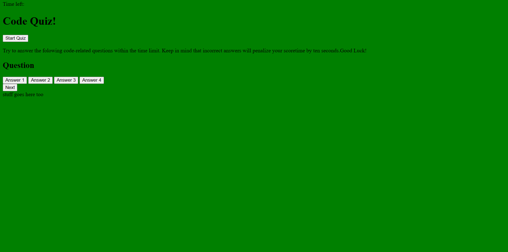

# Code-quiz
random questions about computer coding
computer coding is hard. here is a quiz to test your knowledge. 
Juat a few questions to be answered then you will be graded and see you highscore. But watchout! if you get the wrong answers then your time will drop down ten seconds for every wrong answer. have fun. 
